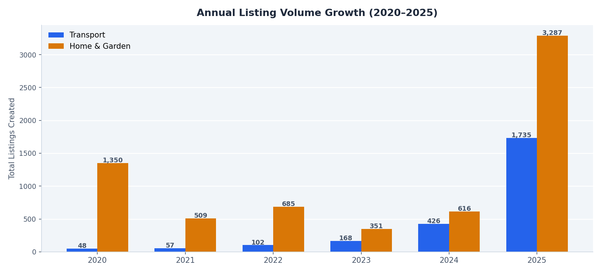
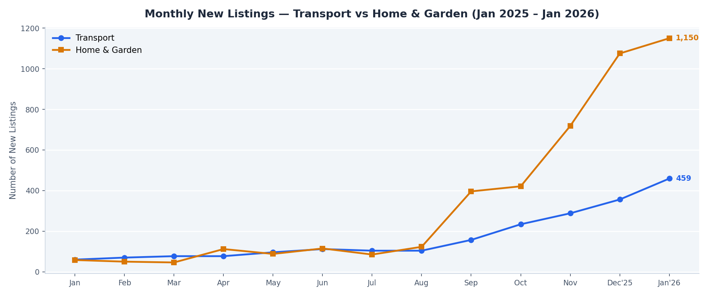
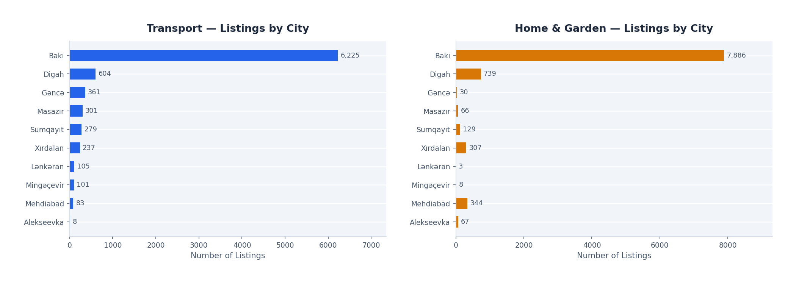
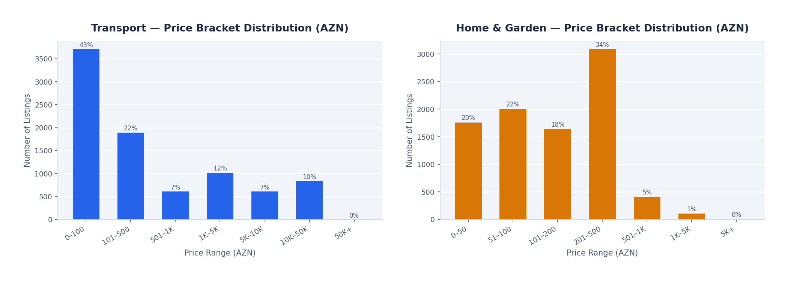
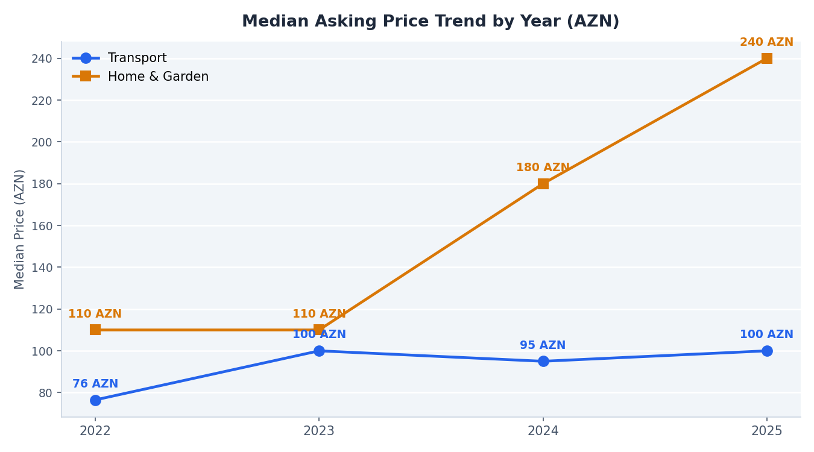
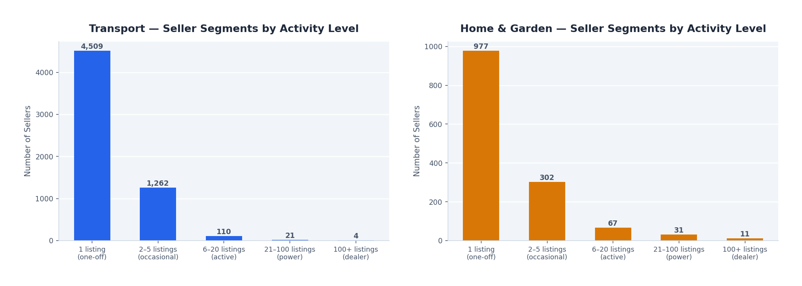
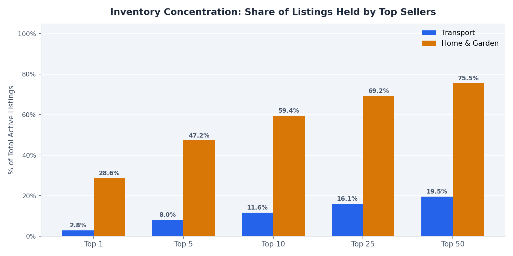
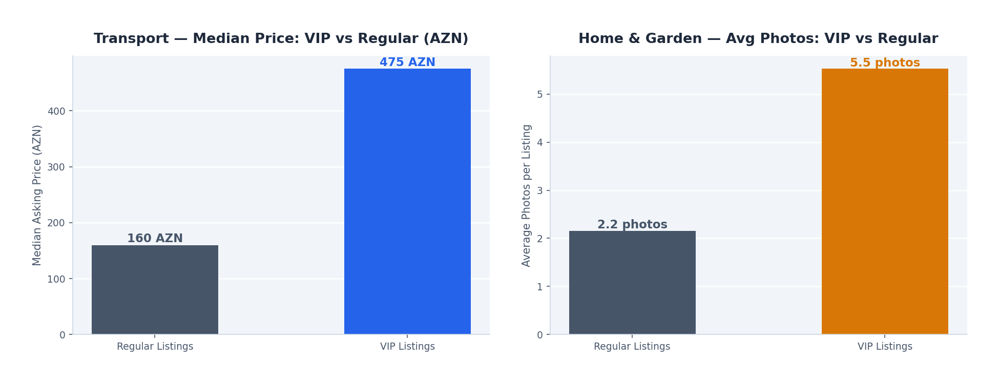

# Lalafo.az Marketplace — Business Intelligence Report
### Transport & Home Categories | Data as of 27 February 2026

---

## Executive Summary

This report analyses **10,194 active transport listings** and **9,800 active home & garden listings** scraped from Azerbaijan's leading online classifieds platform, lalafo.az. The findings reveal a marketplace in strong growth, dominated by Baku, with structurally different competitive dynamics in each category — and clear strategic opportunities for sellers, advertisers, and platform decision-makers alike.

---

## 1. The Market Is Accelerating Fast

**Chart:** `charts/09_yoy_growth.png`

Both categories have grown substantially year over year since 2022, with the sharpest acceleration happening in 2025.

| Category | 2022 Listings | 2023 Listings | 2024 Listings | 2025 Listings | Growth '22→'25 |
|---|---|---|---|---|---|
| Transport | 102 | 168 | 426 | 1,735 | **+1,601%** |
| Home & Garden | 685 | 351 | 616 | 3,287 | **+380%** |

**What this means:** The platform has moved from a niche tool to a mainstream marketplace. The number of sellers and buyers engaging with lalafo.az has grown dramatically. For businesses considering advertising or selling on the platform, the audience size and engagement level are now significantly larger than just two or three years ago.

---

## 2. Month-by-Month: Momentum Is Building Into 2026

**Chart:** `charts/01_monthly_volume.png`

Looking at the 13 months from January 2025 through January 2026, both categories show clear upward trends — but at different paces and with different shapes.

- **Transport** shifted into a higher gear from October 2025 onwards, with monthly volume more than doubling from the summer months. By January 2026, the category was generating nearly **5× more new listings per month** than at the start of 2025.
- **Home & Garden** showed a similar step-change in September 2025, with listings doubling every few months through to January 2026 — reaching **1,150 new listings in a single month**.

**What this means:** Both categories are in expansion phases. New sellers are entering the market at an accelerating rate, which signals growing consumer adoption of the platform and increasing competitive pressure for existing sellers.

---

## 3. Baku Controls the Market — But Regional Cities Offer Opportunity

**Chart:** `charts/02_city_distribution.png`

Baku is overwhelmingly dominant in both categories:

- **Transport:** Baku accounts for **61% of all listings** (6,225 out of 10,194)
- **Home & Garden:** Baku accounts for **80.5% of all listings** (7,886 out of 9,800)

Outside of Baku, the key secondary markets are:

| City | Transport Listings | Home Listings |
|---|---|---|
| Digah | 604 | 739 |
| Gəncə | 361 | 48 |
| Masazır | 301 | — |
| Mehdiabad | — | 344 |
| Xırdalan | — | 307 |
| Sumqayıt | 279 | 129 |

**What this means:** Any national advertising or seller strategy must be anchored in Baku. However, cities like Digah, Gəncə and Sumqayıt have a meaningful presence and represent underserved regional markets where competition is lower and first-mover advantage is available. For the platform, regional expansion is a clear growth lever.

---

## 4. Transport and Home Serve Very Different Price Segments

**Chart:** `charts/03_price_distribution.png`

### Transport

The transport category spans an enormous price range — from cheap spare parts and accessories at a few manat to high-value vehicles worth tens of thousands. The distribution is heavily skewed toward low-price items:

- **43% of listings are priced below 100 AZN** — these are primarily spare parts, accessories, and consumables
- **10% are priced above 10,000 AZN** — these represent vehicles and heavy equipment
- The median asking price is **160 AZN**, reflecting the dominance of the parts/accessories sub-category

### Home & Garden

The home category is far more concentrated in the mid-range:

- **33% of listings fall in the 201–500 AZN band** — the sweet spot for household goods
- **23% are priced under 100 AZN** — small items and fast-moving goods
- The median asking price is **150 AZN**

**What this means:** In transport, there are two distinct sub-markets requiring different strategies: a high-volume, low-value parts market and a lower-volume, high-value vehicle market. Sellers and advertisers should segment their approach accordingly. In home & garden, the market is more unified around a mid-range price point.

---

## 5. Home Prices Have Risen 118% in Three Years

**Chart:** `charts/06_price_trend.png`

The median asking price for home & garden listings has more than doubled over the past three years:

- **2022:** 110 AZN median
- **2023:** 110 AZN median (flat)
- **2024:** 180 AZN median (+64%)
- **2025:** 240 AZN median (+33%)

Transport prices, by contrast, have remained relatively stable in the 76–100 AZN range from 2022 to 2025, reflecting the consistent dominance of low-cost parts and accessories.

**What this means:** Home & garden sellers have been able to command significantly higher prices year over year — suggesting strong demand, tightening supply of quality listings, or a shift in the type of goods being sold (toward higher-value items). For buyers, this is a warning of continued price appreciation. For sellers, it validates entering the home category with quality products at competitive prices.

---

## 6. The Home Category Is Controlled by a Small Group of Power Sellers

**Charts:** `charts/04_seller_segments.png` · `charts/05_inventory_concentration.png`

This is one of the most striking structural differences between the two categories.

### Home & Garden: Highly Concentrated
- The **top 10 sellers control 59.4% of all active listings**
- The **single largest seller holds 28.6% of the entire inventory** (2,807 listings)
- Only 977 sellers have just one listing — indicating the casual/one-off seller segment is small

This pattern is characteristic of a market dominated by professional dealers or aggregators who have built large inventories on the platform.

### Transport: Fragmented and Individual-Driven
- The top 10 sellers account for only **11.6% of listings**
- **4,509 sellers have posted just one listing** — three-quarters of all transport sellers are one-time or occasional users
- Only 4 sellers have more than 100 listings

**What this means:**

- In **Home & Garden**, the dominant sellers function like wholesalers or catalogue resellers. New entrants face an entrenched power seller dynamic and need differentiation (quality, niche, location) to compete. For the platform, the heavy reliance on a handful of accounts is also a concentration risk.
- In **Transport**, the market is grassroots and individual-driven. There is no single dominant competitor. Sellers who establish even a moderate presence (20–50 listings) are already in the top tier. This is an accessible market for new businesses or dealers.

---

## 7. VIP Listings: A Premium Signal in Transport, a Quality Signal in Home

**Chart:** `charts/07_vip_comparison.png`

The lalafo.az VIP feature is used very differently across the two categories:

### Transport — VIP Signals Higher Value
- **VIP transport listings have a median price of 475 AZN**, nearly **3× higher** than the 160 AZN median for regular listings
- This suggests transport sellers are using VIP promotion strategically for their most valuable items — typically vehicles rather than spare parts
- VIP is used by only **1.7%** of transport listings

### Home & Garden — VIP Sellers Invest in Photos
- VIP home listings average **5.9 photos per listing**, compared to **2.1 photos** for regular listings — nearly **3× more visual content**
- Interestingly, VIP home listings have a slightly *lower* median price than regular listings, suggesting VIP is used to drive visibility for competitive, mid-range items rather than exclusively high-value goods
- VIP is used by **5.5%** of home listings

**What this means:** Sellers should align their VIP investment with the category norms. In transport, VIP is most effective for higher-value items where the uplift in visibility justifies the cost. In home & garden, pairing VIP promotion with rich photo content (6–10 photos) appears to be the prevailing strategy among active sellers, and is likely a prerequisite for competitive performance.

---

## 8. Listing Quality Is a Differentiator — But Standards Are Low

**Chart:** `charts/08_listing_quality.png`

Photo quality is one of the clearest indicators of listing effort — and the data shows a market where quality is polarised:

### Transport
- The most common photo count is **1 photo** (34% of listings)
- A significant share (14%) upload the maximum **10 photos**
- Average: **4.0 photos per listing**

### Home & Garden
- The most common photo count is also **1 photo** — an overwhelming **86% of home listings have only 1 photo**
- Yet 14% also max out at 10 photos
- Average: **2.8 photos per listing**

**What this means:** In both categories, the majority of sellers invest minimally in visual presentation. This creates a clear competitive opportunity: listings with multiple, high-quality photos stand out in a sea of single-photo or low-effort listings. For businesses entering either marketplace, investing in product photography is one of the highest-return actions available and comes at virtually no cost compared to paid promotion.

---

## Key Strategic Recommendations

### For Sellers Entering the Platform

1. **Start with Baku** — the overwhelming majority of demand is concentrated there. Expand regionally only once Baku presence is established.
2. **Invest in photos** — uploading 6–10 high-quality images is the single easiest way to outperform 80–90% of competing listings.
3. **In Home & Garden, be ready to compete with power sellers** — the top seller alone holds 28.6% of inventory. Niche, quality, and geography are the main differentiators.
4. **In Transport, build volume** — with the market fragmented and individual-driven, a seller with 50+ quality listings is already in the top tier.
5. **Use VIP selectively** — in transport, reserve VIP for high-value items. In home, pair VIP with rich photo content to match the behaviour of the most active sellers.

### For the Platform (Lalafo.az)

1. **Home supply is over-concentrated** — the dependency on a small number of mega-sellers is a business risk. If the top 1–2 sellers leave, nearly a third of home inventory disappears.
2. **Transport growth is accelerating sharply** — investment in this category's infrastructure, search, and buyer tools will yield returns quickly.
3. **Regional cities are underserved** — Gəncə, Sumqayıt, and Xırdalan have real activity but far less than Baku. Targeted regional seller acquisition could unlock meaningful new inventory.
4. **Listing quality is low on average** — introducing guided listing flows, photo requirements, or quality scores could improve the buyer experience and increase conversion rates platform-wide.

---

*Report generated from lalafo.az live marketplace data | Scraped: 27 February 2026 | 10,194 Transport + 9,800 Home & Garden unique listings*
